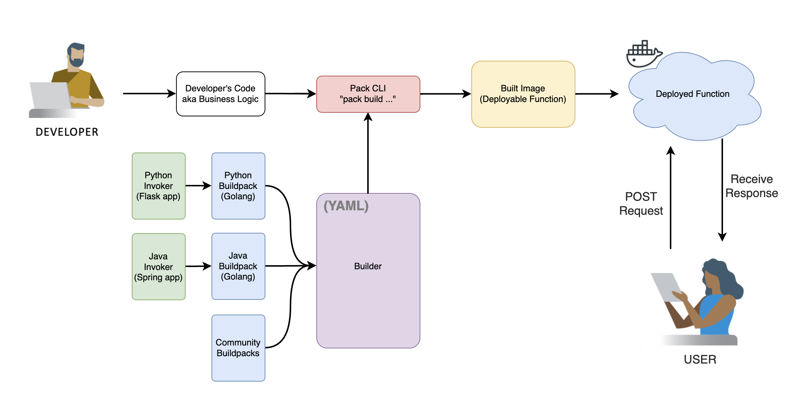

# Contributing to function-buildpacks-for-knative

The function-buildpacks-for-knative project team welcomes contributions from the community. Before you start working with function-buildpacks-for-knative, please
read our [Developer Certificate of Origin](https://cla.vmware.com/dco). All contributions to this repository must be
signed as described on that page. Your signature certifies that you wrote the patch or have the right to pass it on
as an open-source patch.

## Development Flow



As you can see in the diagram's example above, a developer is using one of our Function Templates to write their code into. They run `pack build <name> --builder <builder-version>` to build a version of their code with dependencies included, then they run it in Docker locally to interact as an end user. This is a potential open-source use-case; a Tanzu Application involved use-case would skip several steps and run `tanzu workload create`. 

If we break down what the `--builder` flag entains, it runs the builder provided against our code. This builder could be our provided URL _or_ a local path for an experimental builder.

## Layers Explained

The function-buildpacks-for-knative project is organized into "layers" that sum into our functions experience. These layers create an image that can be used to deploy a FaaS experience in a few short commands.

The `invokers` layer is the lowest level package.

An abstraction level above, `buildpacks` uses `invokers` as a dependency along with bundling other dependencies.

Lastly, at the highest level, the `builder` references the `buildpacks` by URI and SHA as an aggregator. 

The end user should only be interacting with the builder. The name is as it implies -- the builder "builds" functions into images. Interacting with the invokers directly, for example, breaks the abstraction barrier. To learn more about each layer, you may read the `README` for each respective layer's directory.

New additions to the `samples/` and `templates/` directories are welcome -- each directory also has information about usage and testing. We can only accept PRs for these that DO NOT include imports from unvetted repositories or infringing licenses. Please keep them as lightweight and template-able as possible.

To deploy your work, see [DEPLOYING](DEPLOYING.md).

To learn how to test your work, read the [testing documentation](/tests/README.md). We will not accept PRs that fail any tests. If you are including any feature additions, templates, samples, or breaking changes, it is expected that a corresponding test will be added.

> **Note:** To use your own registry for local development and tests, copy and edit [local.example.mk](/local.example.mk) to set the registry to one for which you have read/write access.
> Be sure to also run `make clean` any time you adjust the registry value.

## Contribution Flow

This is a rough outline of what a contributor's workflow looks like:

- Create a topic branch from where you want to base your work
- Make commits of logical units
- Make sure your commit messages are in the proper format (see below) and signed
- Push your changes to a topic branch in your fork of the repository
- Submit a pull request

> ⚠️ You MUST accept the VMware DCO first and SIGN your commits with your legal name, e.g.: "Signed-off-by: John Doe <johndoe@example.com>" will be on a newline at the end of every commit message. You can do this by using `git commit -s -m ...` with the addition of the `-s` flag.

Example:

``` shell
git remote add upstream https://github.com/vmware/function-buildpacks-for-knative.git
git checkout -b my-new-feature main
git add <your-changes>
git commit -s -m "my message here"
git push origin my-new-feature
```

### Staying In Sync With Upstream

When your branch gets out of sync with the vmware/main branch, use the following to update:

``` shell
git checkout my-new-feature
git fetch -a
git pull --rebase upstream main
git push --force-with-lease origin my-new-feature
```

### Updating pull requests

If your PR fails to pass CI or needs changes based on code review, you'll most likely want to squash these changes into
existing commits.

If your pull request contains a single commit or your changes are related to the most recent commit, you can simply
amend the commit.

``` shell
git add .
git commit --amend
git push --force-with-lease origin my-new-feature
```

If you need to squash changes into an earlier commit, you can use:

``` shell
git add .
git commit --fixup <commit>
git rebase -i --autosquash main
git push --force-with-lease origin my-new-feature
```

Be sure to add a comment to the PR indicating your new changes are ready to review, as GitHub does not generate a
notification when you git push.

### Code Style

### Formatting Commit Messages

We follow the conventions on [How to Write a Git Commit Message](http://chris.beams.io/posts/git-commit/).

Be sure to include any related GitHub issue references in the commit message.  See
[GFM syntax](https://guides.github.com/features/mastering-markdown/#GitHub-flavored-markdown) for referencing issues
and commits.

## Reporting Bugs and Creating Issues

When opening a new issue, try to roughly follow the commit message format conventions above.
